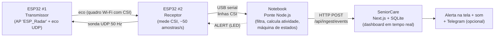

# Fall Detection — detecção de quedas por Wi-Fi (CSI) com ESP32

Sistema **não invasivo** (sem câmeras, microfones ou wearables) que detecta quedas de idosos
observando como o corpo perturba o sinal Wi-Fi entre dois módulos **ESP32**, e envia o alerta
ao painel do **[SeniorCare](https://github.com/patrickgougeon/senior-care)**.

Projeto acadêmico usado em duas disciplinas:

| Disciplina | Entrega | Foco |
|---|---|---|
| Sistemas Embarcados (artigo SBrT) | *Low-Complexity Fall Detection and Environment-Aware Tracking Using Radio Waves* | ESP32, CSI, pipeline de processamento, latência |
| Projeto de Inovação Tecnológica (PIT) — Métodos e Aplicações de IA | *Sistema de Monitoramento e Detecção de Quedas via CSI Wi-Fi* | Problema, mercado, arquitetura, riscos/LGPD, viabilidade |

> **Estado atual: protótipo de laboratório.** Detecta por regras determinísticas calibradas no local
> (não há modelo de ML treinado ainda). Veja [Limitações](#limitações-e-riscos) — elas fazem parte
> do resultado, não são detalhe.

---

## Como funciona



Correspondência com o fluxo do documento PIT (§4) e com as seções do artigo:

| Etapa PIT | O que faz neste protótipo | Onde está |
|---|---|---|
| 1. Sensoriamento | Par de ESP32: o receptor envia sondas e o transmissor responde; o corpo entre eles perturba o canal | `firmware/` |
| 2. Coleta CSI | Amplitude/fase por subportadora (LLTF, 64 subportadoras), ~50 amostras/s | `firmware/csi_receiver` |
| 3. Transporte | **USB serial** ESP32 → notebook (ver nota abaixo sobre MQTT) | `firmware/csi_receiver`, `bridge/src/serial-source.js` |
| 4. Inferência | Filtragem, índice de atividade, calibração, máquina de estados impacto → imobilidade | `bridge/src/detector.js` |
| 5. Alerta | HTTP para o SeniorCare: banner vermelho, alarme sonoro, (opcional) Telegram | `bridge/src/seniorcare-client.js` + repositório `senior-care` |

> **Sobre MQTT:** o documento propõe MQTT para o transporte. Neste protótipo o caminho ESP32 → notebook é a
> USB (mais simples e robusto para a demonstração, sem depender da rede da faculdade — que costuma
> isolar clientes e bloquear broker) e notebook → site é HTTP. MQTT continua sendo o passo natural
> para a versão com o ESP32 falando direto com um servidor remoto.

### O algoritmo de detecção (`bridge/src/detector.js`)

1. **Amplitude por subportadora** de cada pacote, normalizada pela média do pacote (remove variação de ganho do rádio).
2. **Índice de atividade** `A(t)`: desvio-padrão/média de cada subportadora numa janela de 0,6 s, média entre as 52 subportadoras úteis. Ambiente parado ⇒ `A` baixo e estável; pessoa se movendo ⇒ `A` sobe.
3. **Calibração** (8 s com o ambiente parado): a mediana de `A` é o *ruído base*. Todos os limiares são múltiplos dele — o sistema se adapta a cada sala e posição dos módulos.
4. **Máquina de estados**:
   - `monitoring` → `motion` quando `A > 2,5 × base`;
   - `motion` → `evaluating` quando o movimento acaba **e** o pico recente foi `≥ 6 × base` (um *impacto*);
   - `evaluating` → **QUEDA** se a sala fica parada por 3 s; volta a `monitoring` (falso alarme) se o movimento retoma;
   - `alert` → 20 s de silêncio (*cooldown*) para não repetir o alerta.
5. O "índice de confiança" enviado (50–100 %) é **heurístico** (quanto o pico passou do limiar e quão parada ficou a sala). **Não é uma probabilidade calibrada.**

Todos os limiares são ajustáveis por linha de comando (`--motion-ratio`, `--impact-ratio`, `--still-sec`, …).

---

## Estrutura do repositório

```
fall-detection/
├── firmware/
│   ├── csi_transmitter/csi_transmitter.ino   # ESP32 #1: AP "ESP_Radar" + eco UDP
│   └── csi_receiver/csi_receiver.ino         # ESP32 #2: STA + captura de CSI → serial
├── bridge/                                    # roda no notebook (Node.js)
│   ├── src/
│   │   ├── index.js                          # CLI: serial/simulação/replay → detector → SeniorCare
│   │   ├── detector.js                       # algoritmo de detecção
│   │   ├── csi-parser.js                     # linhas da serial → amplitudes
│   │   ├── serial-source.js                  # porta serial (auto-detecção + reconexão)
│   │   ├── seniorcare-client.js              # HTTP com fila e reenvio
│   │   └── simulator.js                      # CSI sintético (testes e plano B da demo)
│   ├── test/detector.test.js                 # testes automatizados (node --test)
│   └── .env.example
├── docs/DEMO.md                              # roteiro da apresentação, ajuste fino e troubleshooting
└── legacy_rssi/                              # primeira versão (RSSI, ESP8266) — só referência
```

---

## Requisitos

- **2× ESP32 clássico** (DevKit) + 2 cabos USB de dados. Um deles fica ligado ao notebook; o outro pode ir em power bank/carregador.
- **Notebook** com Node.js ≥ 18 e Git.
- Arduino IDE 2.x com o pacote de placas **"esp32 by Espressif Systems"** (core 2.0.x ou 3.x).
- O repositório **[senior-care](https://github.com/patrickgougeon/senior-care)** rodando no mesmo notebook.
- Driver USB-serial da placa (CP210x ou CH340), se o Windows não reconhecer a porta.

> ESP32-S2/S3/C3/C6 **não** são suportados por este firmware (a API de CSI é diferente); o sketch avisa na compilação.

---

## Passo a passo (resumo — detalhes em [docs/DEMO.md](docs/DEMO.md))

### 1. Gravar os ESP32

1. Arduino IDE → placa **ESP32 Dev Module**.
2. Abra `firmware/csi_transmitter/csi_transmitter.ino` e grave no **ESP32 #1**.
3. Abra `firmware/csi_receiver/csi_receiver.ino` e grave no **ESP32 #2**.
4. (Opcional) Serial Monitor do receptor em **921600 baud**: deve mostrar `[RX] conectado!` e linhas `CSI,...`.

### 2. Subir o SeniorCare

```bash
cd senior-care
npm install
npx prisma migrate deploy
npm run db:seed        # cria conta demo e IMPRIME a apiKey do dispositivo
npm run dev            # http://localhost:3000
```

Login demo: `demo@seniorcare.local` / `demo12345` (só para uso local).

### 3. Rodar a ponte

```bash
cd fall-detection/bridge
npm install
cp .env.example .env        # (Windows: copy .env.example .env) e cole a apiKey em SENIORCARE_API_KEY
npm start
```

A ponte acha a porta sozinha (ou use `--port COM4`). Ao iniciar, ela **calibra por 8 s — mantenha a
área entre os ESP32 parada**. Depois disso o dashboard mostra "Monitorando".

### 4. Testar

Ande entre os módulos (o índice de atividade sobe no gráfico do dashboard) e simule uma queda
controlada (cair sobre colchão/almofadas — **com segurança**) e fique imóvel ~4 s: a ponte imprime
`🚨 QUEDA DETECTADA` e o dashboard exibe o alerta vermelho 1–2 s depois (o painel consulta o servidor a cada 1,5 s).

### Sem hardware (ensaio ou plano B)

```bash
cd bridge
npm run simulate                       # cenário completo: caminha, senta, cai, levanta
node src/index.js --simulate fall      # só a queda
node src/index.js --simulate walk      # só atividade normal — NÃO deve alertar
node src/index.js --simulate demo --dry-run   # sem enviar ao site
npm test                               # testes do detector
```

> ⚠️ O simulador é um modelo **sintético simplificado**. Ele valida a lógica do detector e a
> integração com o site, **não** o desempenho com sinal Wi-Fi real. Se usá-lo numa apresentação, diga que é simulação.

---

## Coletando dados para o artigo

```bash
# grava CSI cru com rótulo (um arquivo por ensaio)
node src/index.js --record recordings/queda_01.csv --label queda_colchao
node src/index.js --record recordings/caminhada_01.csv --label caminhada

# reprocessa offline com outros limiares, sem hardware
node src/index.js --replay recordings/queda_01.csv --impact-ratio 5
```

- **Latência ponta a ponta** (seção IV-C do artigo): ao confirmar a queda, a ponte imprime
  `alerta entregue ao SeniorCare em N ms` (tempo do POST até a resposta). A latência total percebida =
  tempo de confirmação (≥ `--still-sec`, 3 s por padrão — é uma escolha de projeto para evitar falso positivo) + esse envio.
- **Taxa de amostragem**: `--verbose` mostra pacotes/s recebidos (nominal ≈ 50).
- Registre por ensaio: posição dos módulos, distância, pessoa, tipo de movimento, e se houve alerta —
  isso dá a matriz de resultados (acertos, falsos positivos, quedas lentas perdidas) do artigo/PIT.

---

## Limitações e riscos

Reflete o §8 do documento PIT — e o que observamos no código:

- **Falsos negativos (quedas lentas/escorregões):** pico pequeno ⇒ abaixo do limiar de impacto. Risco maior em banheiros (piso úmido).
- **Falsos positivos:** sentar/deitar/agachar rápido seguido de imobilidade pode parecer queda; animais de estimação e objetos em movimento também perturbam o canal. Alarmes falsos recorrentes derrubam a credibilidade do produto.
- **Sem modelo treinado:** limiares por regras, calibrados no local. O PIT prevê classificador supervisionado (Random Forest/SVM/DL) como próxima fase — depende de um dataset rotulado, que é o principal gargalo (poucos registros reais de queda).
- **Multipath/interferência 2,4 GHz e mobília:** o desempenho depende da posição dos módulos e exige recalibração se o ambiente mudar.
- **Pessoa parada ≠ pessoa no chão:** o sistema mede *movimento*, não postura. A confirmação por imobilidade é uma heurística.
- **Escopo:** ambiente interno, um cômodo por par de módulos; a atenuação por paredes impede uso externo.
- **Segurança:** dispositivo IoT pode ser adulterado/desligado; o site marca o dispositivo como *offline* se a ponte ficar 15 s sem enviar sinal, e a ponte envia `device_offline` se o CSI parar.
- **Cadeia de resposta:** o alerta só tem valor com um protocolo de resposta (quem vê, em quanto tempo, o que faz se ninguém confirmar).

### Privacidade e LGPD

Não há imagem nem áudio, mas a **presença e os padrões de movimento numa residência são dado pessoal sensível de saúde/comportamento**. Em uso real: consentimento explícito **do idoso** (não só do contratante), minimização (o CSI cru **não** é armazenado por padrão — só eventos e metadados chegam ao servidor; `--record` é opt-in para coleta de pesquisa), criptografia ponta a ponta e controle de acesso ao histórico.

---

## Roadmap (alinhado às fases do PIT)

1. **Protótipo (este repositório):** ambiente controlado, detecção por regras, alerta no painel.
2. **Validação:** ampliar a matriz de ensaios (estaturas, dinâmicas, quedas lentas), medir falsos positivos/semana, testes de aceitação com 3–5 idosos e famílias.
3. **Governança:** protocolo de emergência, SLA de resposta, LGPD.
4. **Piloto/MVP:** classificador supervisionado sobre CSI, ESP32 enviando por MQTT, notificações Push/SMS/Telegram, OTA de firmware, multi-cômodo.

## Referências

- Documento **PIT** — *Sistema de Monitoramento e Detecção de Quedas via CSI Wi-Fi* (casos WiFall e Deep Learning para Parkinson citados lá).
- Artigo SBrT — referências [1]–[13] do manuscrito, incluindo radar mmWave para detecção de quedas.
- Espressif — *Wi-Fi Driver / CSI* (`esp_wifi_set_csi*`) e o projeto [`esp-csi`](https://github.com/espressif/esp-csi).
- Código anterior (RSSI): pasta [`legacy_rssi`](legacy_rssi/).
